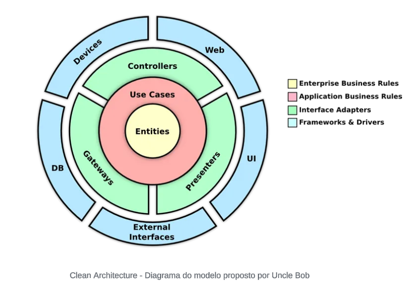
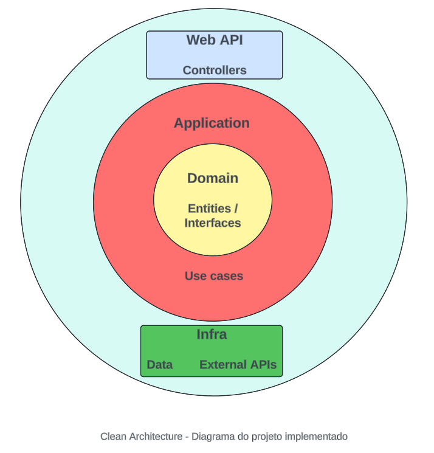
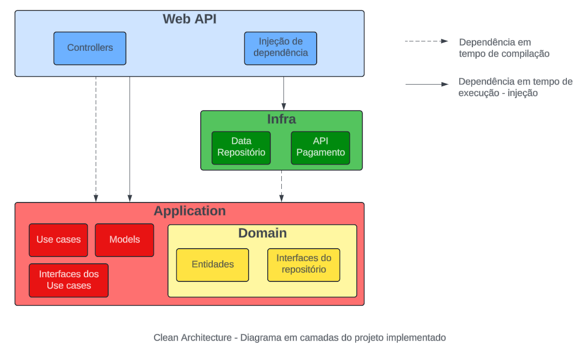
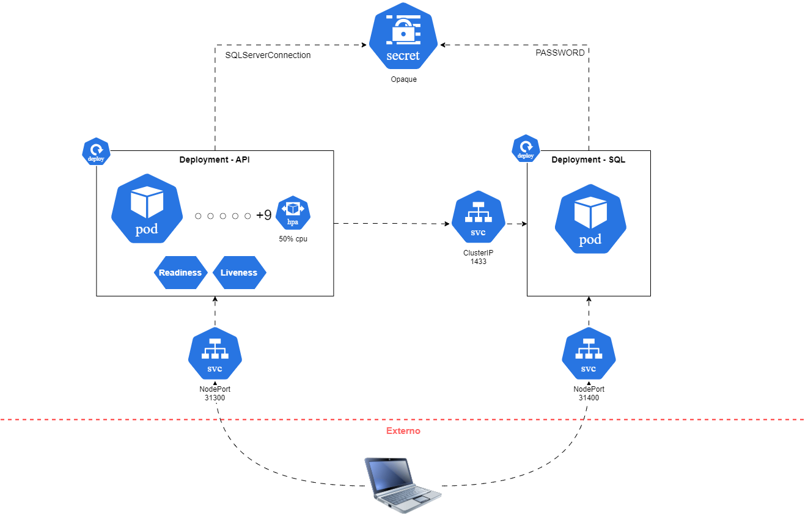

# Tech Challenge - FIAP - Grupo 12

## Descrição
Este repositório contém o código fonte de uma api de garenciamento para lanchonete, conforme desafio técnico proposto nas disciplinas de Arquitetura de Software da Pós Tech - FIAP.

A API está desenvolvida em .NET 8, e tem por objetivo gerenciar as principais operações de uma lanchonete, considerando o cadastro de clientes, produtos, criação e acompanhamento de pedidos, e pagamentos.

## Fase 2 - Clean Architecture e Kubernetes

### Requisitos do negócio (problema).

#### Motivação:  Lanchonete em expansão, porém sem um sistema de pedidos. 

#### Requisitos de alto nível:

Criar um sistema de pedidos para garantir um atendimento melhor e mais rápido.

O sistema deve ser de autoatendimento onde o próprio cliente pode fazer seus pedidos sem precisar interagir com um atendente.

#### Requisitos do sistema:

##### *Pedido*

1. Entrada do sistema onde o cliente pode se identificar com o CPF, se cadastrar com nome e email ou não se identificar indo diretamente ao pedido
2. Criação do pedido selecionando os produtos do tipo Lanche, Acompanhamento, Bebida ou Sobremesa
3. Escolha da opção de pagamento e apresentação da interface para realização de pagamento (de início somente um QRCode do mercado livre)
4. Processamento do retorno da confirmação ou recusa do pagamento
5. Exibição do detalhe e status do pedido para acompanhamento do cliente
6. Exibição do novo pedido para a cozinha iniciar o preparo. Status inicial Recebido.
7. Alteração do status do pedido pela cozinha (Em preparação, Pronto)
8. Na exibição do detalhe, notificar que o produto está pronto quando a Cozinha altera o status para Pronto
9. Alteração do status para finalizado pelo atendente que entregou o pedido

##### *Área administrativa*

1. Gestão de clientes (listar clientes)
2. Gestão de produtos (criar, atualizar, excluir)
3. Acompanhamento dos pedidos (listar mostrando andamento e tempo de espera)

### a. Desenho da arquitetura 

#### i. Arquitetura da Solução em .Net
A arquitetura criada usou como base a arquitetura limpa (Clean Architecture) proposta por Robert Martin (Uncle Bob). A arquitetura referência segue abaixo:

<p align="center">
  &nbsp;&nbsp;&nbsp;&nbsp;&nbsp;&nbsp;&nbsp;&nbsp;&nbsp;&nbsp;&nbsp;&nbsp;&nbsp;&nbsp;&nbsp;&nbsp;&nbsp;&nbsp;&nbsp;&nbsp;&nbsp;&nbsp;&nbsp;&nbsp;&nbsp;&nbsp;
</p>

Esta é a forma como foi implementada no nosso projeto .Net:

<p align="center">
  
</p>

Esta é a forma representada em camadas como foi implementada no nosso projeto .Net

<p align="center">
  
</p>

#### ii. Infraestrutura - Kubernetes

<p align="center">
  
</p>

### b. APIs desenvolvidas:
b.i. Collection com exemplos de requisições
- [Link da Collection do Postman (JSON)](Documentação/Postman/FIAP.TechChallenge.ByteMeBurguer.API.postman_collection.json)
- [Link do Environment do Postman (JSON)](Documentação/Postman/Development.postman_environment.json)

b.ii Ordem das requisições
1. Produto/CriarProduto (Lanche)
2. Produto/CriarProduto (Bebida)
3. Produto/CriarProduto (Acompanhamento)
4. Cliente/CadastrarCliente 
5. Pedido/CriarPedido


### c. Guia completo com todas as instruções para execução do projeto e a ordem de execução das APIs
#### c.i Sequência de execução dos arquivos Kubernetes

```bash
kubectl apply -f 1-secret-techchallenge-opaque.yaml
kubectl apply -f 2-deployment-techchallenge-sql.yaml
kubectl apply -f 3-svc-techchallenge-cluster-ip-sql.yaml
kubectl apply -f 4-svc-techchallenge-sql-node.yaml
kubectl apply -f 5-deployment-techchallenge.yaml
kubectl apply -f 6-svc-techchallenge-node.yaml
kubectl apply -f 7-hpa-techchellenge.yaml
kubectl apply -f 8-components.yaml
```

#### c.ii Após a inicialização dos pods, acesse o swagger da aplicação para ter acesso a todos os endpoints

   > [http://localhost:31300/swagger/index.html](http://localhost:31300/swagger/index.html)

#### c.iii Sequência de execução para deletar toda a infra do Kubernetes

```bash
kubectl delete -f 8-components.yaml
kubectl delete -f 7-hpa-techchellenge.yaml
kubectl delete -f 6-svc-techchallenge-node.yaml
kubectl delete -f 5-deployment-techchallenge.yaml
kubectl delete -f 4-svc-techchallenge-sql-node.yaml
kubectl delete -f 3-svc-techchallenge-cluster-ip-sql.yaml
kubectl delete -f 2-deployment-techchallenge-sql.yaml
kubectl delete -f 1-secret-techchallenge-opaque.yaml
```

### d. [Link para vídeo demonstrando a arquitetura desenvolvida localmente

[Veja aqui o vídeo completo](https://www.youtube.com/watch?v=AldG-c2Itg4)

Sequência do vídeo:

Introdução - Contexto e tecnologias utilizadas

Parte 1 - Arquitetura limpa e projeto .Net

Parte 2 - Exemplo do Postman e da sequência de requisições

Parte 3 - Arquitetura infra - Kubernetes

Conclusão
